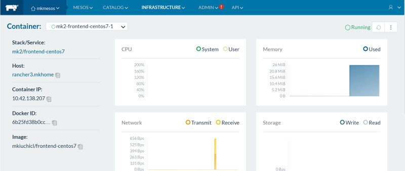
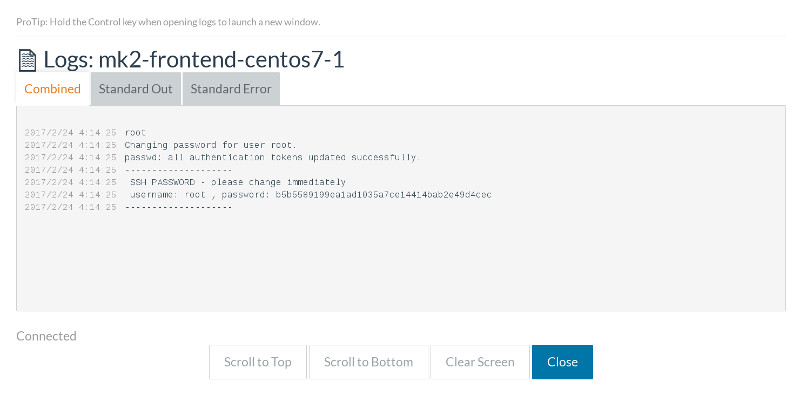
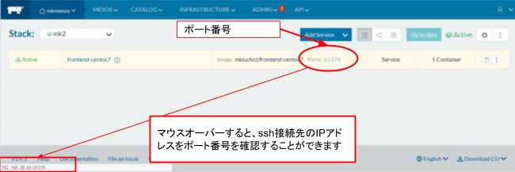

# フロントエンド - CentOS7

フロントエンドシェル用に利用できる CentOS7 イメージです。sshでログインすることができます。

## 使用方法

以下の項目を入力・選択します

- Template Version: 使用したいバージョンのテンプレートを選択します
- New Stack:Name: スタック名に使用されます

`Launch` ボタンを押します。

上部メニューから [INFRASTRUCTURE]-[Containers] を選択します


コンテナ一覧から <スタック名>-<イメージ名>-<番号> の適切なコンテナを検索します。ここでは `mk2-frontend-centos7-1` を選択します。


コンテナの稼働状況が表示されます。右上のメニューから [View Logs] を選択すると、コンテナ起動時に設定されたユーザ名とパスワードが表示されます。






コンテナの稼働状況画面の左上のスタック名をクリックすると、ssh接続先のIPアドレスをポート番号を確認することができます




sshは以下のように実行します

```
$ ssh -l <ユーザ名> -p <ポート番号> <接続先IPアドレス>
```
